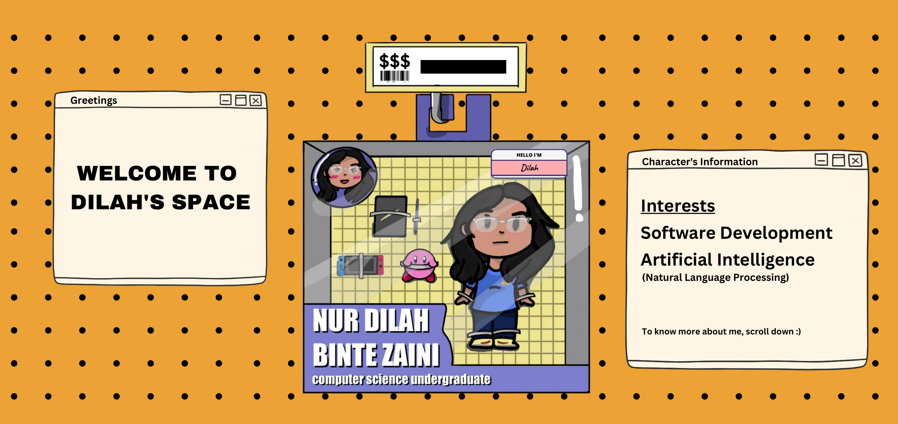

## Hi There, I'm Dilah 🙂
* 🎓 I'm a computer science undergraduate at NTU
* ⌨ I enjoy programming and love to learn new things
* 📚 My passion lies in software development and artificial intelligence

### 📬 Get In Touch
* 🔗 LinkedIn - [@Nur Dilah Binte Zaini](https://www.linkedin.com/in/nur-dilah-binte-zaini-582b701a3/)
* 📧 You can contact me [nurdilah352@gmail.com](mailto:nurdilah352@gmail.com)

### 💻 Programming Languages

    
    
    
    
    
    
    
    

### 🛠️ Software and Tools

    
    
    
    
    
    

### 🖌️ Design

    
    
    
    

